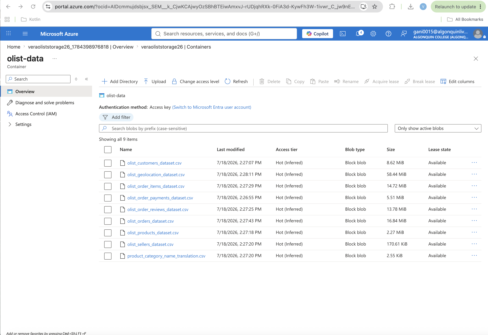
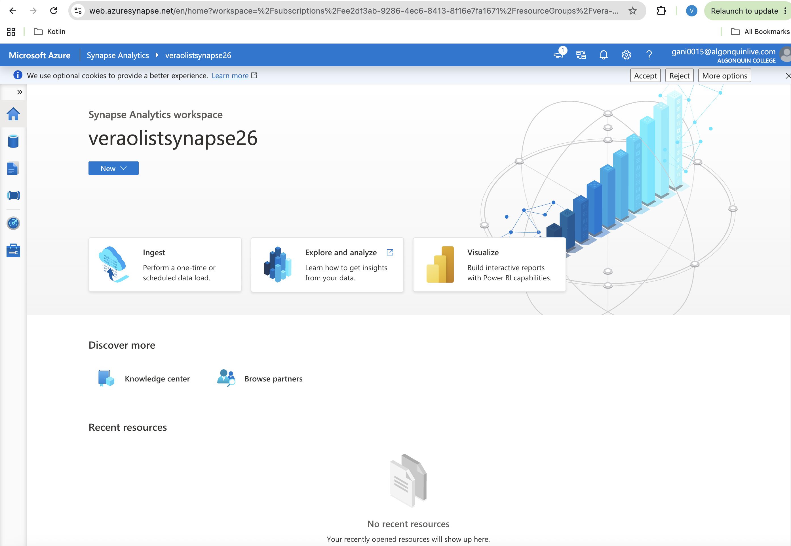
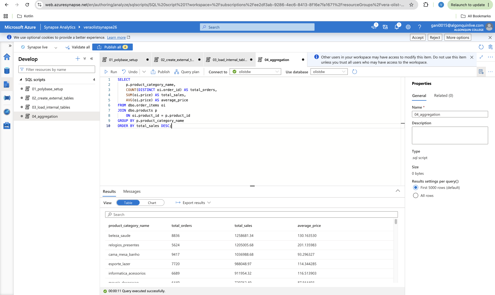
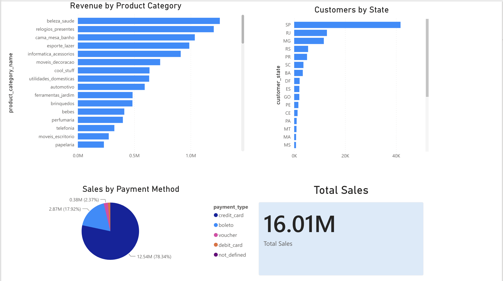

# Brazilian E-Commerce Azure Data Warehouse

An end-to-end cloud data engineering project built with Azure Data Lake Storage Gen2, Azure Synapse Analytics, PolyBase, T-SQL, and Power BI.

## Project Overview

This project demonstrates an end-to-end cloud data engineering workflow using the Brazilian E-Commerce Public Dataset (Olist). The solution ingests raw CSV files into Azure Data Lake Storage Gen2, loads the data into Azure Synapse Analytics using PolyBase, transforms the data into an analytics-ready warehouse with T-SQL, and creates interactive Power BI dashboards for business reporting.

## Key Features

- Azure cloud data pipeline
- Data ingestion with PolyBase
- Data warehouse creation using CTAS
- Business analytics with T-SQL
- Interactive Power BI dashboard

---

## Architecture

Data Source (CSV files)
        ↓
Azure Data Lake Storage Gen2
        ↓
PolyBase External Tables
        ↓
Azure Synapse Analytics
        ↓
Internal Data Warehouse Tables (CTAS)
        ↓
T-SQL Analytics
        ↓
Power BI Dashboard

---

## Technologies used

- Azure Data Lake Storage Gen2
- Azure Synapse Analytics
- PolyBase
- T-SQL
- Power BI
- Python
- Pandas
- Git & GitHub

---

## Dataset

**Brazilian E-Commerce Public Dataset by Olist from Kaggle**

I selected this dataset because it represents a realistic business scenario for building a cloud data warehouse. The dataset contains multiple related tables, including customers, orders, products, payments, and reviews, making it well suited for practicing data modeling, SQL joins, aggregations, and analytical reporting. Its size is large enough to demonstrate an end-to-end Azure Synapse workflow.

The dataset contains information about:

- Customers
- Orders
- Products
- Order Items
- Payments
- Reviews
- Sellers

---

## Project Structure

```text
brazilian-ecommerce-azure-project/
│
├── data/
│   └── raw/
├── notebooks/
├── screenshots/
├── sql/
│   ├── 01_polybase_setup.sql
│   ├── 02_create_external_tables.sql
│   ├── 03_load_internal_tables.sql
│   ├── 04_aggregation.sql
│   ├── 05_customer_orders.sql
│   └── 06_pivot_sales.sql
├── report/
└── README.md
```

---

## SQL Workflow

The SQL scripts are organized by stage:

| Script | Purpose |
|---------|----------|
|01_polybase_setup.sql|Configure PolyBase|
|02_create_external_tables.sql|Create external tables|
|03_load_internal_tables.sql|Load data into Synapse using CTAS|
|04_aggregation.sql|Revenue analysis|
|05_customer_orders.sql|Customer and order analysis|
|06_pivot_sales.sql|Payment method analysis using PIVOT|

---

## Dashboard

The Power BI dashboard includes:

- Revenue by Product Category
- Customers by State
- Sales by Payment Method
- Total Sales KPI

---

## Screenshots

### Azure Storage Container

Raw Olist CSV files uploaded to Azure Data Lake Storage Gen2.



### Azure Synapse Analytics

Azure Synapse workspace used to build the data warehouse.



### SQL Query Execution

Analytical query executed successfully in Azure Synapse Analytics.



### Power BI Dashboard

Interactive dashboard created from the Azure Synapse data warehouse.


